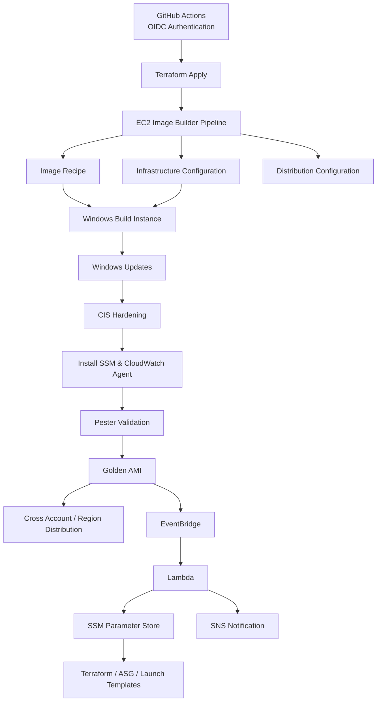

# Golden Image Pipeline — Windows Server (EC2 Image Builder)

Enterprise-pattern golden image pipeline for Windows Server, built with EC2 Image Builder and Terraform. Designed to slot into a hub-and-spoke landing zone: build once in a central image factory account, distribute to spoke accounts via Image Builder's distribution config.

## What this creates

- **GitHub OIDC provider + IAM role** — lets GitHub Actions assume an AWS role via short-lived OIDC tokens, no long-lived access keys. Trust is scoped to your specific repo, branch(es), and optionally `pull_request` events. Permissions are least-privilege, split by service, and scoped to this module's actual resource ARNs rather than a blanket Image Builder/EC2 full-access policy
- **Image recipe** — base AMI (via SSM alias, always latest patched) + ordered components (Windows Updates → CIS hardening → agents → validation tests)
- **Infrastructure configuration** — the temporary build/test EC2 environment, with S3 logging
- **Distribution configuration** — copies the finished AMI to N accounts / N regions, encrypted with your KMS key, with launch permissions granted automatically
- **Image pipeline** — orchestrator with a monthly (patch-Tuesday-aligned) schedule
- **EventBridge + Lambda** — on successful build, automatically updates an SSM parameter (`/golden-images/<name_prefix>/latest-ami-id`) so downstream Terraform never hardcodes an AMI ID
- **IAM roles** — least-privilege roles for the build instance and the update Lambda

## Prerequisites before `terraform apply`

1. **Network**: `subnet_id` must reach SSM endpoints — either a private subnet with `com.amazonaws.<region>.ssm`, `ssm-messages`, `ec2messages` VPC endpoints, or a subnet with NAT/IGW egress. Image Builder controls the instance entirely through SSM, not SSH/RDP.
2. **KMS key**: create or reference an existing key. The build account's key policy must allow `kms:CreateGrant` for Image Builder, and if you distribute cross-account, the spoke accounts' roles need `kms:Decrypt` on that key (or use per-region/per-account keys with cross-account grants — common gap people hit on first run).
3. **Base image ARN**: confirm the current SSM alias string for your target Windows Server version — `aws ssm get-parameters --names /aws/service/ami-windows-latest/Windows_Server-2022-English-Full-Base` gives you the current AMI ID; Image Builder wants the imagebuilder-format ARN shown in `terraform.tfvars.example`.
4. **Lambda zip**: `lambda/update_ssm_param.zip` is already built from `lambda/index.py` in this scaffold. If you edit `index.py`, rezip: `cd lambda && zip update_ssm_param.zip index.py`.

## Deploy

```bash
cp terraform.tfvars.example terraform.tfvars
# edit terraform.tfvars with your subnet, SG, KMS key, account IDs

terraform init
terraform plan
terraform apply
```

First build won't start automatically — the schedule only triggers *future* runs. Kick off the first build manually:

```bash
aws imagebuilder start-image-pipeline-execution \
  --image-pipeline-arn $(terraform output -raw pipeline_arn)
```

## Wiring into GitHub Actions

Mirror your existing Terraform + Ansible plan/apply pattern:

- **On push to `main`** (component or recipe changes) → `terraform plan` / `apply` to update the pipeline definition, then `start-image-pipeline-execution` to trigger a fresh build
- **On schedule** → Image Builder's own cron handles this; GitHub Actions doesn't need to poll
- **Post-build** → no GitHub Actions step needed; the EventBridge + Lambda flow updates SSM automatically. Optionally add a workflow step that reads the SSM parameter and opens a PR bumping any version pins in downstream repos.

## Consuming the golden AMI downstream

```hcl
data "aws_ssm_parameter" "golden_ami" {
  name = "/golden-images/golden-win2022/latest-ami-id"
}

resource "aws_instance" "example" {
  ami           = data.aws_ssm_parameter.golden_ami.value
  instance_type = "t3.large"
  # ...
}
```

Never hardcode an AMI ID in launch templates/ASGs — always read this parameter.

## Extending the hardening component

`components/cis-hardening.yaml` covers only the highest-impact CIS controls inline, as a starting point. For full compliance coverage, swap that block for one of:

- Microsoft's official CIS Benchmark GPO baseline, imported via `LGPO.exe`
- A PowerShell DSC configuration pulled from your org's compliance-as-code repo
- Ansible playbook invocation (since you already have Windows Ansible pipelines, you could call `ansible-pull` from within the component instead of inline PowerShell)

## Known gaps to fill in for your environment

- **Domain join**: no component for AD DS / Azure AD join — add one if Client workloads need domain membership baked in (often better done at launch time via SSM Association instead, so the golden image stays domain-agnostic and reusable across environments)
- **EDR/AV agent**: `agent-install.yaml` has a placeholder step — plug in your actual agent installer, pulling the binary/token from S3 or Secrets Manager, never hardcoded
- **Cross-account KMS grants**: not automated here — if spoke accounts are in a different Organization or you're not using a single multi-region key, add explicit grants
- **Multi-version**: this scaffold builds one Windows Server version; duplicate the module (different `name_prefix` + `base_image_arn`) per OS version you need to support

## GitHub OIDC setup notes

- **One OIDC provider per AWS account per URL.** If you already created `token.actions.githubusercontent.com` as a provider for another pipeline (e.g. `Terraform-Drift-Detection`), set `create_oidc_provider = false` and pass that provider's ARN via `existing_oidc_provider_arn` — otherwise `terraform apply` fails with a "provider already exists" error.
- **Trust is branch + event scoped**, not just repo-scoped. By default only `main` and `pull_request` events are trusted (`allowed_branches`, `allow_pull_requests` in `terraform.tfvars`). A workflow running from any other branch will get an `AccessDenied` on `sts:AssumeRoleWithWebIdentity` — this is intentional, tighten or loosen via those two variables.
- **First apply is a bootstrapping problem.** This OIDC role is what your GitHub Actions workflows assume to manage this module — but the module itself creates that role. Apply this once manually (your own credentials) before the workflows can run, then hand off to CI for everything after.
- After applying, copy the `github_actions_role_arn` output into the `AWS_OIDC_ROLE_ARN` GitHub repo secret referenced by both workflow files.
- The IAM policy ARN patterns in `oidc-github-actions.tf` reference `var.name_prefix` directly, so renaming `name_prefix` in `terraform.tfvars` automatically keeps the OIDC role's permissions scoped correctly — no separate edits needed.

---

## AWS EC2 Image Builder - Windows Server 2022 Golden AMI Pipeline

### Overview

This Terraform module provisions a **production-ready EC2 Image Builder pipeline** for automatically building, testing, hardening, validating, encrypting, and distributing **Windows Server 2022 Golden AMIs**.

The solution includes:

- Automated Windows patching
- CIS hardening
- SSM & CloudWatch Agent installation
- Validation using Pester
- Cross-account AMI distribution
- Event-driven automation
- GitHub Actions OIDC integration
- Automated SSM Parameter updates
- SNS notifications

---

### AWS Resources Created

#### Core Image Builder Resources

| Resource | Purpose |
|----------|---------|
| `aws_imagebuilder_image_pipeline` | Orchestrates the entire build pipeline |
| `aws_imagebuilder_image_recipe` | Defines base AMI, components and block device mappings |
| `aws_imagebuilder_infrastructure_configuration` | Build instance configuration including subnet, IAM role, security groups and logging |
| `aws_imagebuilder_distribution_configuration` | Defines target accounts, regions, launch permissions and encryption |
| `aws_imagebuilder_component` (×4) | Windows Updates, CIS Hardening, Agent Install and Validation |

---

### Custom Image Builder Components

| Component | Purpose |
|-----------|---------|
| `components/windows-updates.yaml` | Install latest Windows Updates |
| `components/cis-hardening.yaml` | Apply CIS Benchmark hardening |
| `components/agent-install.yaml` | Install and validate SSM & CloudWatch Agent |
| `components/validation-test.yaml` | Execute Pester validation tests |

---

### IAM Resources

| Resource | Purpose |
|----------|---------|
| `aws_iam_role.imagebuilder_instance_role` | EC2 Image Builder Instance Role |
| `aws_iam_role_policy_attachment.ssm_managed_instance_core` | AmazonSSMManagedInstanceCore |
| `aws_iam_role_policy_attachment.imagebuilder_instance_policy` | EC2InstanceProfileForImageBuilder |
| `aws_iam_role_policy_attachment.imagebuilder_ecr_logs` | ECR Container Build permissions |
| `aws_iam_instance_profile.imagebuilder_profile` | Instance Profile used during build |

---

### Event-Driven Automation

| Resource | Purpose |
|----------|---------|
| `aws_cloudwatch_event_rule.image_state_change` | Detect Image Builder state changes |
| `aws_cloudwatch_event_target.invoke_update_lambda` | Invoke Lambda |
| `aws_lambda_permission.allow_eventbridge` | Allow EventBridge to invoke Lambda |
| `aws_iam_role.lambda_update_role` | Lambda execution role |
| `aws_iam_role_policy.lambda_update_policy` | Permissions for SSM, SNS, Logs, Image Builder |
| `aws_lambda_function.update_golden_ami_parameter` | Update SSM Parameter Store with latest AMI |

---

### Storage & Logging

| Resource | Purpose |
|----------|---------|
| `aws_s3_bucket.imagebuilder_logs` | Store Image Builder logs |
| `aws_s3_bucket_lifecycle_configuration.imagebuilder_logs` | Delete logs after 180 days |
| `aws_s3_bucket_public_access_block.imagebuilder_logs` | Disable public access |

---

### Parameter Store

| Resource | Purpose |
|----------|---------|
| `aws_ssm_parameter.golden_ami_latest` | Stores latest validated Golden AMI ID |

Parameter Name:
```
/golden-images/golden-win2022/latest-ami-id
```

---

### GitHub Actions OIDC Integration

| Resource | Purpose |
|----------|---------|
| `aws_iam_openid_connect_provider.github` | GitHub OIDC Provider |
| `aws_iam_role.github_actions` | IAM Role assumed by GitHub Actions |
| `aws_iam_role_policy.github_actions_permissions` | Least privilege permissions |

---

### Input Variables

| Variable | Required | Default |
|----------|----------|---------|
| `name_prefix` | No | `golden-win2022` |
| `aws_region` | No | `us-east-1` |
| `base_image_arn` | No | AWS Windows 2022 Base Image |
| `instance_types` | No | `["t3.large","t3a.large"]` |
| `subnet_id` | **Yes** | — |
| `security_group_ids` | **Yes** | — |
| `instance_profile_name` | No | `golden-win2022-imagebuilder-profile` |
| `kms_key_id` | **Yes** | — |
| `distribution_accounts` | No | `[]` |
| `distribution_regions` | No | `{}` |
| `schedule_cron` | No | Second Saturday Monthly |
| `sns_topic_arn` | No | `""` |
| `github_org` | **Yes** | — |
| `github_repo` | **Yes** | — |

---

### Outputs

| Output | Description |
|--------|-------------|
| `pipeline_arn` | Image Builder Pipeline ARN |
| `recipe_arn` | Image Recipe ARN |
| `golden_ami_ssm_parameter_name` | SSM Parameter Name |
| `logging_bucket` | S3 Logging Bucket |
| `infrastructure_configuration_arn` | Infrastructure Configuration ARN |
| `distribution_configuration_arn` | Distribution Configuration ARN |
| `github_actions_role_arn` | IAM Role ARN for GitHub Actions |
| `github_oidc_provider_arn` | GitHub OIDC Provider ARN |

---

### GitHub Actions Workflows

| Workflow | Trigger | Purpose |
|----------|---------|---------|
| `golden-image-build.yml` | Push, Schedule, Manual | Trigger Image Builder Pipeline |
| `golden-image-terraform.yml` | Terraform Changes | Terraform Plan & Apply |

---

### Architecture



---

### Build Workflow

```text
GitHub Actions
        │
        ▼
Terraform Apply
        │
        ▼
Create Image Builder Resources
        │
        ▼
Launch Build Instance
        │
        ▼
Install Windows Updates
        │
        ▼
Apply CIS Hardening
        │
        ▼
Install SSM & CloudWatch Agent
        │
        ▼
Execute Validation Tests
        │
        ▼
Create Golden AMI
        │
        ▼
Copy AMI to Target Accounts & Regions
        │
        ▼
EventBridge Notification
        │
        ▼
Lambda Function
        │
        ├── Update SSM Parameter
        └── Publish SNS Notification
```

---

### Prerequisites

The following resources **must already exist** before deploying this module:

- VPC Subnet with SSM VPC Endpoints or NAT Gateway
- Security Groups
- KMS Key
- SNS Topic (optional but recommended)
- Target AWS Account IDs
- GitHub Repository
- GitHub OIDC (or existing provider)

---

### Key Features

- Enterprise-ready Golden AMI Pipeline
- Automated Windows Updates
- CIS Benchmark Hardening
- Automated Validation (Pester)
- Cross-Account Distribution
- Multi-Region Distribution
- KMS Encryption
- GitHub Actions OIDC Authentication
- Event-Driven Automation
- Automated SSM Parameter Updates
- SNS Notifications
- Infrastructure as Code using Terraform
- Production Ready

---

### Technology Stack

- Terraform
- AWS EC2 Image Builder
- AWS Lambda
- Amazon EventBridge
- Amazon SNS
- AWS Systems Manager Parameter Store
- Amazon S3
- IAM
- GitHub Actions
- OIDC Authentication
- Windows Server 2022
- PowerShell
- Pester Testing